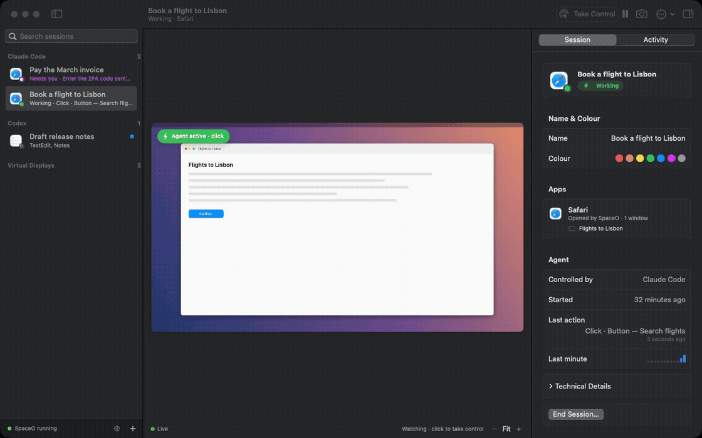
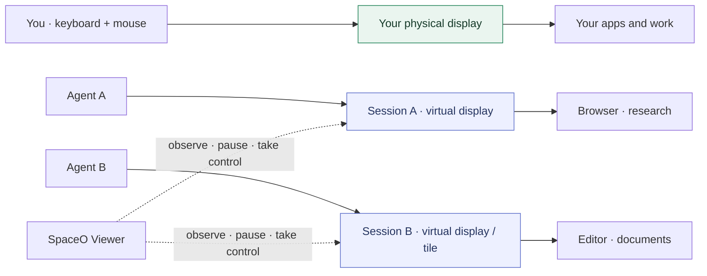
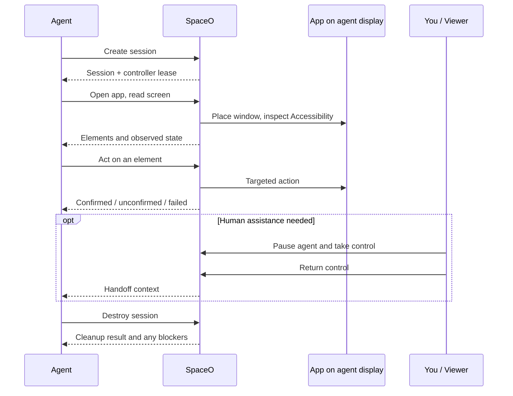
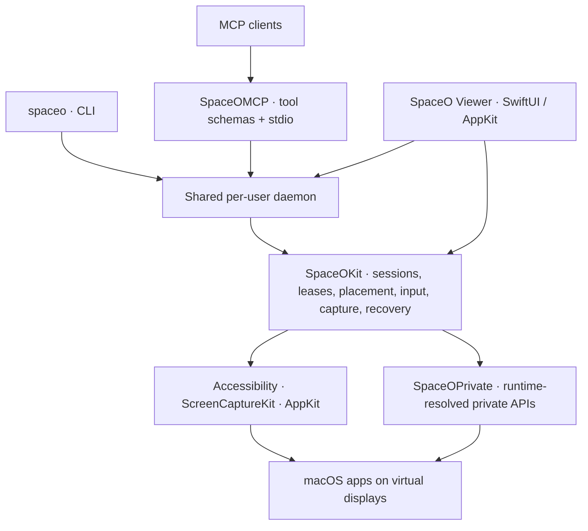

<p align="center">
  
</p>

<h1 align="center">Give AI agents their own screen on your Mac.</h1>

<p align="center">
  Let agents work in real apps while you keep using your computer.<br>
  SpaceO runs agent apps on separate, headless displays.
</p>

<p align="center">
  <a href="https://github.com/ParthJadhav/SpaceO/actions/workflows/ci.yml"></a>
  
  
  <a href="LICENSE"></a>
  
</p>

<p align="center">
  <a href="#get-started">Get started</a> ·
  <a href="#how-it-works">How it works</a> ·
  <a href="#faq">FAQ</a> ·
  <a href="docs/SETUP.md">Setup guide</a> ·
  <a href="https://github.com/ParthJadhav/SpaceO/releases">Releases</a> ·
  <a href="docs/REFERENCE.md">Reference</a>
</p>



*Recorded from the real SpaceO Viewer using synthetic preview sessions and sample screen content.
[View the still screenshot](docs/images/viewer.png).*

> [!NOTE]
> **Development preview · 1.1.1 source.** There is no qualified signed DMG available yet.
> Build from source below; approved DMGs will appear on the [Releases page](https://github.com/ParthJadhav/SpaceO/releases).
>
> **First DMG scope: native apps and Chromium browsers.** Managed Electron apps such as
> Cursor and VS Code are refused before launch because they can take desktop focus.
> These editors can still connect to SpaceO as MCP clients to drive supported apps.

## A screen for every agent

| You keep working | Your agents keep working |
| --- | --- |
| Your physical display stays available | Apps render on headless virtual displays |
| Your pointer stays where you put it | Accessibility actions and targeted events operate apps |
| You decide when to intervene | Viewer shows sessions, activity, pause, and human handoff |
| Multiple agents can share one Mac | Sessions own apps, windows, and display tiles |

SpaceO is a native Swift app, a CLI, and an MCP server. Agents can read interface elements,
click controls, enter text, inspect screenshots, and check what actually happened. Sessions can
use dedicated displays or share a display in separate tiles.

### What an agent can do

| Capability | MCP tools |
| --- | --- |
| Own a workspace | `spaceo_session_create`, `spaceo_session_destroy`, `spaceo_session_list`, `spaceo_pool_status` |
| Launch and place apps | `spaceo_open_app`, `spaceo_open_url`, `spaceo_adopt_app`, `spaceo_place_window`, `spaceo_list_windows` |
| See the interface | `spaceo_read_screen`, `spaceo_find`, `spaceo_read_text`, `spaceo_screenshot`, `spaceo_wait_for` |
| Act on it | `spaceo_click`, `spaceo_type`, `spaceo_press_key`, `spaceo_scroll`, `spaceo_drag`, `spaceo_menu`, `spaceo_select_text` |
| Batch and verify | `spaceo_run_steps`, `spaceo_verify_isolation`, `spaceo_events` |
| Hand off to you | `spaceo_session_pause`, `spaceo_session_resume`, per-session clipboard broker |

Actions prefer Accessibility elements over coordinates, and every receipt says whether the result
was **confirmed**, **unconfirmed**, or **refused**. The [reference](docs/REFERENCE.md) lists every
tool and CLI command.

## How it works



An inactive Mission Control Space can stop an app from drawing. A virtual **display** keeps its
windows available to the compositor, capture, and Accessibility. SpaceO places agent windows
there and sends actions to the target without deliberately activating it or moving your pointer.

Apps can still activate themselves, and macOS private APIs can change. SpaceO reports observed
isolation failures and checks it cannot establish; an attempted action is not automatically
reported as a confirmed result.

> [!IMPORTANT]
> **Attention isolation is not a security sandbox.** Agent apps run as your macOS user, with that
> user’s files, network, credentials, and app sessions. Use a separate login or VM for untrusted
> workloads. Keep SIP enabled. See the [security policy](SECURITY.md).

## Get started

You need Apple Silicon, macOS 14 or later, and a recent Xcode toolchain with Swift 6.2 or later.
CI selects Xcode 26.3. Runtime support depends on your macOS build; start with the read-only check.

Virtual-display creation uses runtime capability checks on macOS 14 and later, with bounded
lifecycle waits and creation limits. See [display safety](docs/DISPLAY_SAFETY.md).

```bash
git clone https://github.com/ParthJadhav/SpaceO.git
cd SpaceO
make install
export PATH="$HOME/.local/bin:$PATH"
spaceo doctor
```

When your desktop is idle, run guided setup. It requests Accessibility and Screen Recording,
starts the daemon, and creates a temporary display to check session creation and capture.

```bash
spaceo setup
```

A passing setup check does not qualify all input or isolation behavior. Follow the
[setup guide](docs/SETUP.md) for permissions, compatibility, and your first session.

**Connect an agent**

```bash
# Claude Code
claude mcp add -s user spaceo -- "$HOME/.local/bin/spaceo" mcp
```

For other MCP clients, use the absolute path to `spaceo` with the argument `mcp`.
[Client configurations](docs/REFERENCE.md#mcp-configuration) cover Codex, Cursor, and Claude Desktop.

Then ask your agent something like *"Open TextEdit in SpaceO, write a short note, and show me a
screenshot"*. It creates its own session and cleans it up when it finishes.

**Or drive an app yourself from the CLI**

```bash
spaceo daemon &
eval "$(spaceo session create --session try --export)"   # sets SPACEO_SESSION and SPACEO_LEASE
spaceo run TextEdit
spaceo ax                  # list indexed Accessibility elements
spaceo click --element 0
spaceo type "hello from another display"
spaceo screenshot -o /tmp/try.png
spaceo session destroy
spaceo daemon stop
```

**Open the Viewer from a source build**

```bash
SPACEO_CODESIGN_IDENTITY=- make viewer
open ".build/SpaceO Viewer.app"
```

This produces a local development build. Approved releases will contain a Developer ID-signed,
notarized Viewer and CLI in a signed, stapled DMG. See [installation and verification](docs/INSTALL.md).

## From request to result



## Architecture



Private API resolution stays in one target. Higher layers enforce bounded requests, ownership,
capability checks, and explicit partial results. Controller leases coordinate clients running
as the same user; they do not create a separate security boundary.

Read the [architecture](ARCHITECTURE.md), [runtime API support](docs/PRIVATE_API_SUPPORT.md), and
[session recovery](docs/SESSION_RECOVERY.md) documents for the contracts and limitations.

## FAQ

**Why not just use another Space or a VM?**
Apps on an inactive Mission Control Space can stop drawing, so they can't be captured or
reliably driven. A VM works but has no access to your installed apps, sign-ins, or files. SpaceO
keeps apps in your login on displays you don't see.

**Will it steal my focus or move my mouse?**
SpaceO never warps the pointer and does not deliberately activate agent apps. Apps can still
activate themselves. When that happens, SpaceO reports the breach instead of hiding it
(`spaceo_verify_isolation`).

**Which apps work?**
Native macOS apps and Chromium browsers (Chrome, Chromium, Edge, Brave, Vivaldi, Opera, Arc) are in scope.
Apps built on Electron, such as Cursor, VS Code, and Slack, are refused before launch in this
preview, because their renderers can take desktop focus.

**Is it a sandbox?**
No. Agent apps run as your user, with your files, network, and credentials. Use a separate login
or VM for untrusted work.

**Why does it use private APIs?**
macOS has no public API for creating virtual displays or delivering targeted background input.
SpaceO resolves these APIs at runtime, confines them to one target, and fails closed when a
capability is missing. See [runtime API support](docs/PRIVATE_API_SUPPORT.md).

**How do I remove it?**
Run `spaceo daemon stop`, then delete `~/.local/bin/spaceo` and the Viewer app. Full steps are in
[INSTALL.md](docs/INSTALL.md#uninstall).

## Develop and contribute

```bash
make build
make test             # deterministic; no app launches or synthetic input
make verify-release   # optimized build, safe tests, MCP smoke checks
```

Live tests create displays and drive real apps. Read [LIVE_TESTS.md](docs/LIVE_TESTS.md) and use
an eligible idle host. Skipped live tests are not release evidence.

See [CONTRIBUTING.md](CONTRIBUTING.md) for changes and review, [AGENTS.md](AGENTS.md) for repository
conventions, and [CHANGELOG.md](CHANGELOG.md) for what is implemented.

| Learn more | |
| --- | --- |
| [Reference](docs/REFERENCE.md) | CLI, MCP, Viewer controls, tiling, and capability status |
| [Troubleshooting](docs/TROUBLESHOOTING.md) | Permissions, sessions, input, and recovery |
| [Updates](docs/UPDATING.md) | Version checks and daemon upgrades |
| [Support](SUPPORT.md) | Supported platforms and known limits |
| [Security](SECURITY.md) | Private vulnerability reporting and trust boundaries |
| [Release policy](docs/RELEASE_POLICY.md) | Signing, qualification, and publication approval |

Released under the [MIT license](LICENSE). macOS and Apple frameworks remain subject to Apple’s
terms; SpaceO does not include Apple SDKs or private-framework binaries.
